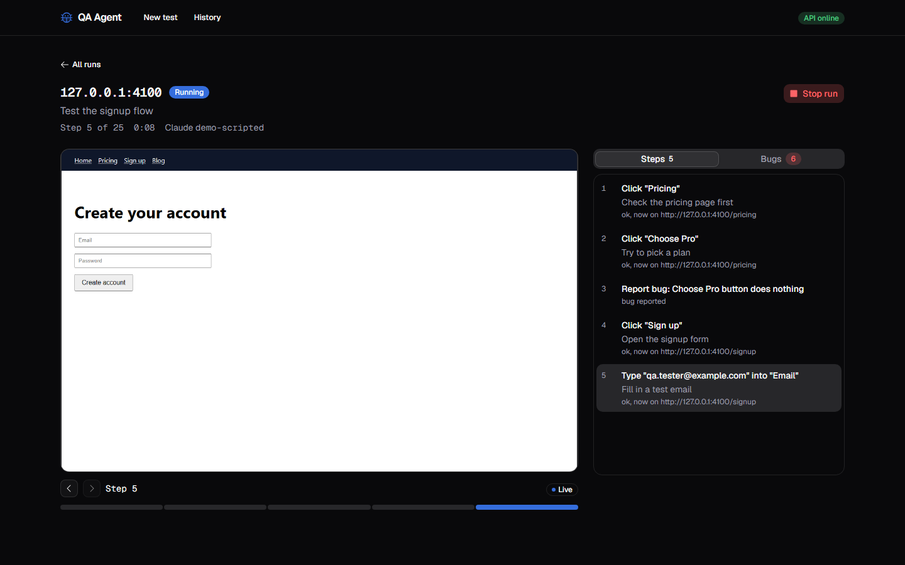
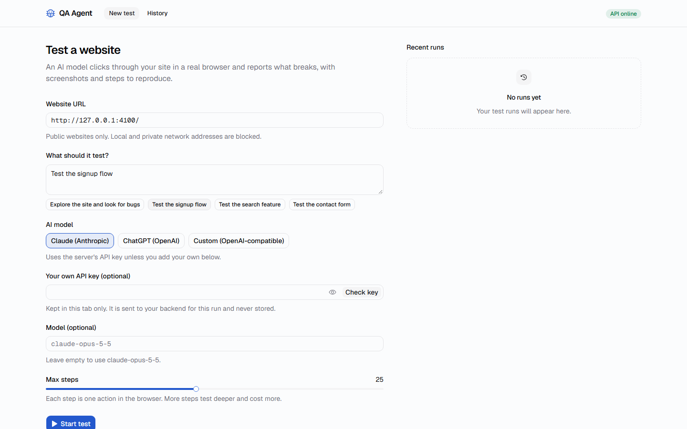
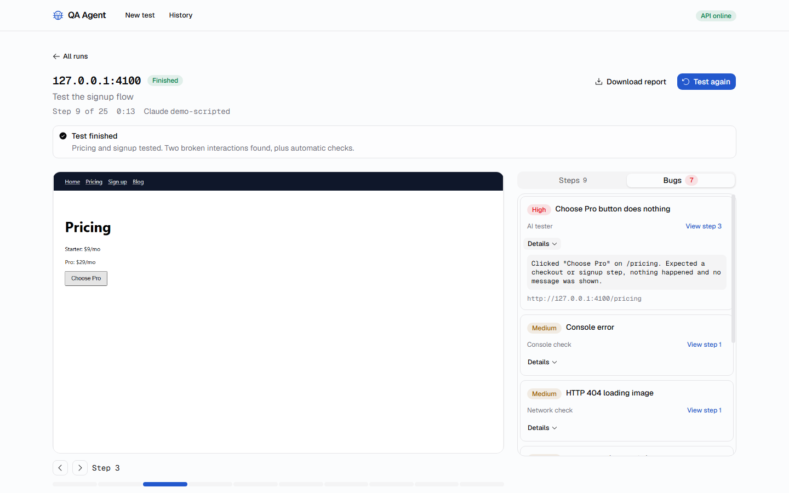
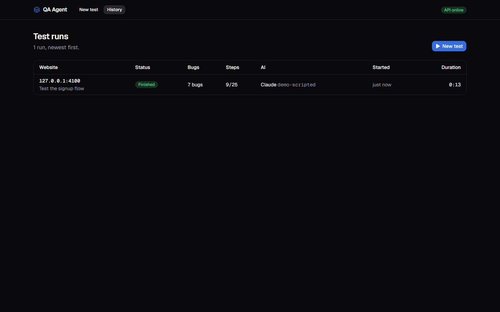

# QA Agent

**An AI agent that tests websites the way a person would.** Give it a URL and a goal like "test the signup flow". It opens a real browser, clicks and types its way through the site, and writes a bug report with screenshots and steps to reproduce.



## What it does

- **Tests like a user.** An AI model (Claude, ChatGPT, or any OpenAI-compatible API) looks at each screenshot, picks one action (click, type, navigate, scroll, report a bug, finish) and Playwright performs it in Chromium.
- **Catches what the AI might miss.** Automatic checks on every page: JavaScript errors, failed requests, broken links and accessibility problems (missing alt text, unlabeled fields, buttons without names).
- **Shows its work live.** Screenshots, steps and bugs stream to the browser as they happen. Jump from any bug to the moment it was found.
- **Writes the report.** Every run produces a Markdown report with bugs sorted by severity, steps to reproduce and screenshots.
- **Bring your own key.** Use the server's API key, your own Claude or OpenAI key, or any OpenAI-compatible endpoint (OpenRouter, Groq, Together, Gemini, Mistral) with a base URL.

| Start a test | Inspect bugs | Run history |
|---|---|---|
|  |  |  |

## Try it without an API key

```bash
npm run setup     # installs backend + frontend, downloads Chromium
npm run demo      # builds the UI and starts demo mode
```

Open http://localhost:4000 and test `http://127.0.0.1:4100/`, a small demo shop with deliberate bugs. A scripted AI drives the browser, so everything works without a key or any cost.

## Use it for real

```bash
cp backend/.env.example backend/.env    # optional: add ANTHROPIC_API_KEY or OPENAI_API_KEY
npm run build
npm start                               # http://localhost:4000
```

Without server keys, paste your own key in the form. It stays in your browser tab and the server never stores it.

For development, run `npm run dev` in both `backend/` and `frontend/` and open http://localhost:5173.

## How it works

```
  URL + goal ─▶  ┌─ observe ─ screenshot + numbered clickable elements
                 ├─ check ─── console, network, links, accessibility
                 ├─ decide ── the AI picks one action (validated before it runs)
                 └─ act ───── Playwright performs it; repeat until done
                        │
                        ▼
        live events (SSE) ─▶ React UI      run.json + report.md + screenshots
```

| Part | Stack |
|---|---|
| [Backend](backend) | Node.js 22, TypeScript, Fastify, Playwright, Anthropic SDK, OpenAI SDK |
| [Frontend](frontend) | React 19, TypeScript, Vite, shadcn/ui (Base UI), Tailwind CSS v4, SWR |

## Security

The server opens URLs that users type in, so it is built to be safe to expose:

- **No access to private networks.** `localhost`, private IP ranges and cloud metadata addresses are blocked for every request the browser makes, including redirects, images and clicks, and for custom API base URLs.
- **API keys are never stored.** Bring-your-own keys live in memory for one run. Tests check they never reach disk, reports, API responses or logs.
- **AI output is untrusted.** Every action is validated before it runs, and website text is treated as data, not instructions.
- **Reports are escaped**, so a page can't inject HTML or tracking images into them.

Details and known limits are in the [backend README](backend/README.md#security).

## Tests

```bash
npm test          # 21 backend tests
npm run test:e2e  # 3 end-to-end browser tests of the whole app
```

All tests use a local test site and a scripted AI: no API key, no paid calls.

## Project layout

```
backend/    API, agent loop, browser control, reports  (see backend/README.md)
frontend/   React app: new test, live run, history     (see frontend/README.md)
docs/       Screenshots
```
